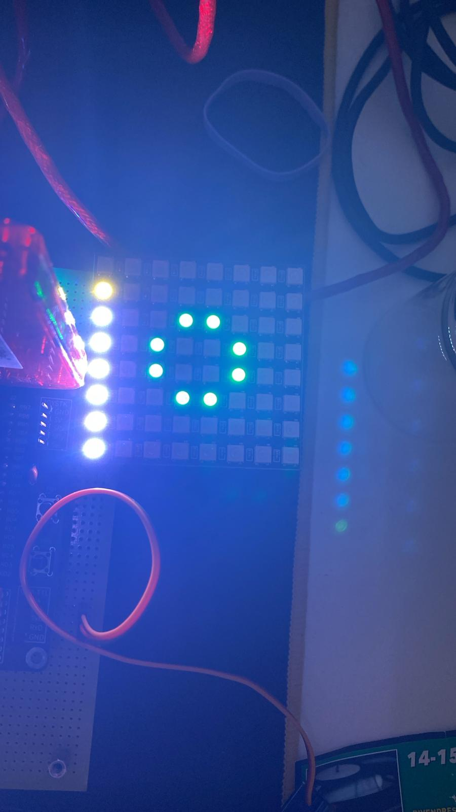
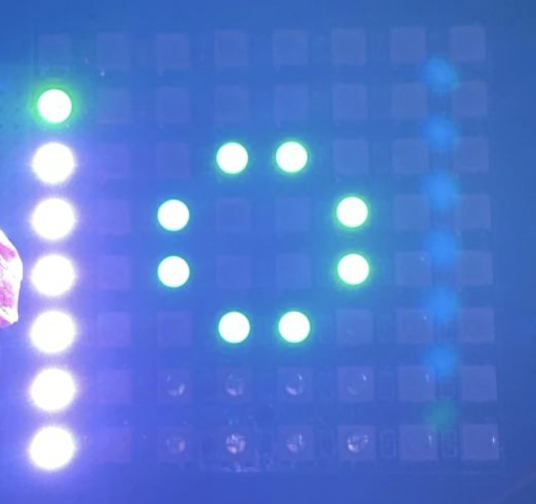
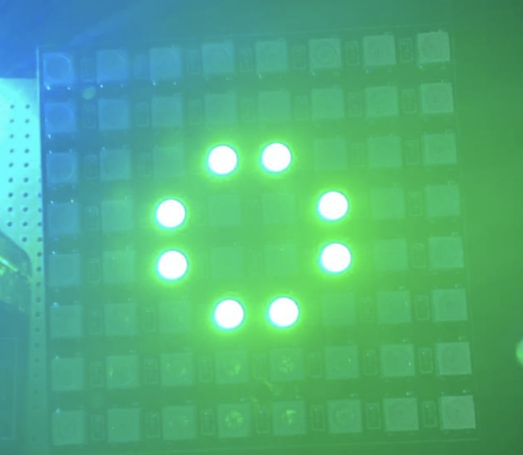

# Problemas encontrados

## 1. LEDs fantasma en la primera fila tras arranque (POR)

**Fecha:** 2026-05-08

**Sintoma:** Al alimentar el PIC (power-on reset), aparecen pixeles fantasma en la primera fila de la matriz WS2812B (pixel 0 y alrededores). El resto de la cara se muestra correctamente. El problema NO ocurre al usar Mode_Reset desde el menu.

### Antes del fix (pixeles blancos)

Se observan LEDs blancos en la columna izquierda (primera fila) que no deberian estar encendidos. La cara del tamagotchi se muestra desplazada.

### Despues de anadir update_display flag (pixeles verdes)

Tras anadir el flag `update_display` para que `Bucle_Menu` redibuje en la primera iteracion, el pixel fantasma paso a ser verde (el color correcto de la cara) en vez de blanco, pero seguia apareciendo el pixel 0 encendido.

### Resultado esperado (display limpio - tras Mode_Reset)

Asi se ve correctamente tras usar Mode_Reset desde el menu.

### Analisis

La diferencia clave entre MAIN (falla) y Mode_Reset (funciona):

- **Mode_Reset:** Cuando se ejecuta, RA4 lleva mucho tiempo en LOW (todo el tiempo del bucle de menu). El WS2812B esta en estado reset limpio antes del primer byte.
- **MAIN (boot):** RA4 se configura como salida LOW en `Init_Puertos`, pero entre esa configuracion y el primer `Dibuixa_Cara_Edat` hay muy poco tiempo. El WS2812B necesita >50us de LOW para entrar en estado reset. Durante el power-on, el pin RA4 estaba flotando (TRISA=0xFF por defecto en POR), y el WS2812B pudo captar ruido como datos validos.

### Intentos de solucion

1. **Doble llamada a `Dibuixa_Cara_Edat`:** No funciono. El segundo dibujo aterriza limpio pero el problema seguia.
2. **`WS_Reset` antes del primer dibujo:** Anade >50us de LOW garantizado antes de transmitir. Parcialmente efectivo.
3. **Flag `update_display` + `Espera_Rebots` (16ms):** Combina un primer dibujo en init con un segundo dibujo via flag en `Bucle_Menu`, con 16ms de espera adicional. Pendiente de verificacion.

### Estado

En investigacion.

---

## 2. Servo SG90 provoca reset del PIC (Brown-out Reset)

**Fecha:** 2026-05-08

**Sintoma:** Al activar el PWM del servo SG90 en RC1, el PIC se reseteaba continuamente. La edad nunca incrementaba, el hambre tampoco avanzaba, y la pantalla parpadeaba (flash). El servo se movia ligeramente y volvia a 0.

### Analisis

El servo SG90 puede consumir hasta 700mA bajo carga. Si se alimenta desde el PICkit3 (que suministra corriente limitada por USB), el consumo del servo provoca una caida de tension en la linea de 5V. El PIC18F4321 tiene Brown-out Reset (BOR) activado por defecto, con umbral ~4.2V. Al caer la tension por debajo de ese umbral, el PIC se resetea.

El ciclo observado era:
1. PIC arranca, ISR genera pulso servo
2. Servo se mueve, consume corriente
3. Tension cae por debajo del umbral BOR
4. PIC se resetea (vuelve a MAIN)
5. Repetir — el PIC nunca llega a contar 1 segundo

Esto explicaba todos los sintomas: edad estancada, hambre estancada, pantalla parpadeando (cada reset redibuja), servo que vuelve a 0 (cada reset reinicializa a 0 grados).

### Solucion

Alimentar el servo con una fuente externa de 5V independiente del PICkit3. Conectar la masa (GND) de la fuente externa con la masa del PIC para tener referencia comun.

### Leccion aprendida

Los actuadores (servos, motores, matrices LED grandes) nunca deben alimentarse desde el programador. Usar siempre fuente externa con masas conectadas.
